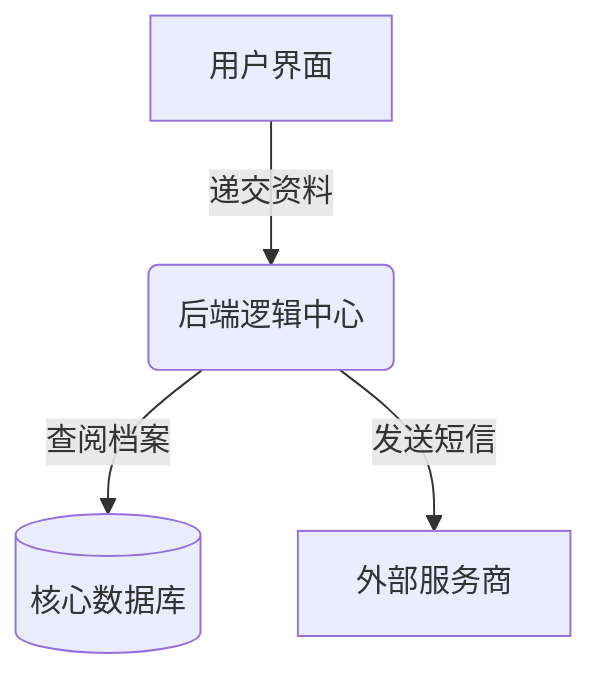

# 技术设计文档 (TDD)：代码逻辑可视化工具

## 1. 系统架构图

系统采用 **前后端分离架构**，核心逻辑由 **AI 编排层** 驱动。

* **Frontend (React)**: 处理文件上传、Mermaid 图表渲染、拟人化群聊组件动画。
* **Backend (FastAPI)**: 处理文件流、解析目录结构、调用 AI 向量化服务。
* **AI Orchestration (LangChain/LlamaIndex)**: 负责代码的分片（Chunking）、索引（Indexing）以及针对不同任务的 Prompt 路由。

---

## 2. 核心技术组件

### 2.1 代码解析与 RAG 流程

由于代码库可能很大，直接全部丢给 AI 会导致 Token 溢出或成本过高。我们采用 **RAG (检索增强生成)** 方案：

1. **预处理**：使用 `tree-sitter` 或简单的文件树遍历，提取项目目录结构。
2. **摘要化**：对每个核心文件（如 `.py`, `.js`, `.java`）提取类名、函数名及注释，生成极简摘要。
3. **向量化**：将摘要存入向量数据库（如 ChromaDB），以便后续精准检索业务逻辑。

### 2.2 “群聊化”生成算法

这是本产品的技术核心。逻辑流程如下：

* **输入**：用户选择的业务场景（如“用户注册”）。
* **检索**：AI 在向量库中搜索与“注册”相关的函数调用链路（Trace）。
* **推理**：
* 将 `Controller` 映射为“前台小妹”。
* 将 `Database` 映射为“档案管理员”。
* 将 `Service` 映射为“业务部主管”。


* **输出**：基于 JSON 格式的剧本，前端解析并循环播放。

---

## 3. 关键数据模型 (Schema)

### 3.1 剧本 JSON 结构

```json
{
  "scenario": "用户登录流程",
  "characters": [
    {"id": "fe", "name": "网页小美", "role": "Frontend", "personality": "急躁但专业"},
    {"id": "be", "name": "后端阿强", "role": "Backend", "personality": "沉稳保守"},
    {"id": "db", "name": "老墨", "role": "Database", "personality": "记性好但动作慢"}
  ],
  "dialogues": [
    {"from": "fe", "to": "be", "content": "阿强，有人要翻牌子（登录），这是他的暗号！", "code_ref": "login.js:L45"},
    {"from": "be", "to": "db", "content": "老墨，查下档案，有没有叫‘张三’的？", "code_ref": "auth_service.py:L12"},
    {"from": "db", "to": "be", "content": "等会儿... 翻到了！密码对得上。", "code_ref": "user_model.sql:L5"}
  ]
}

```

---

## 4. 接口设计 (API Design)

| 接口 | 方法 | 功能 |
| --- | --- | --- |
| `/api/upload` | POST | 上传 ZIP 包，返回任务 ID 开启异步解析。 |
| `/api/project/structure` | GET | 获取项目白话版的目录树。 |
| `/api/chat/generate` | POST | 输入业务场景关键词，获取拟人化群聊剧本。 |
| `/api/explain/term` | GET | 传入代码片段，返回小白版的术语解释。 |

---

## 5. 核心逻辑实现细节

### 5.1 目录结构可视化

利用 **Mermaid.js** 的 `graph TD` 语法。后端 AI 会根据文件引用关系，动态生成如下字符串并交给前端：



### 5.2 性能优化：异步解析流

1. 用户上传文件。
2. 后端立即返回 `taskId`，前端展示“AI 正在翻阅代码...”的进度条。
3. 后端开启解析线程：
* Step 1: 扫描文件树（快）。
* Step 2: 调用 LLM 生成各文件白话摘要（中）。
* Step 3: 建立业务逻辑索引（慢）。


4. 通过 **WebSocket** 实时推送解析进度。

---

## 6. 安全性与隐私

* **代码脱敏**：在发送给大模型之前，通过正则过滤 `API_KEY`、`PASSWORD`、`IP 地址`。
* **内存存储**：解析结果仅保留在内存/临时数据库中，用户关闭项目后 24 小时自动物理删除。

---